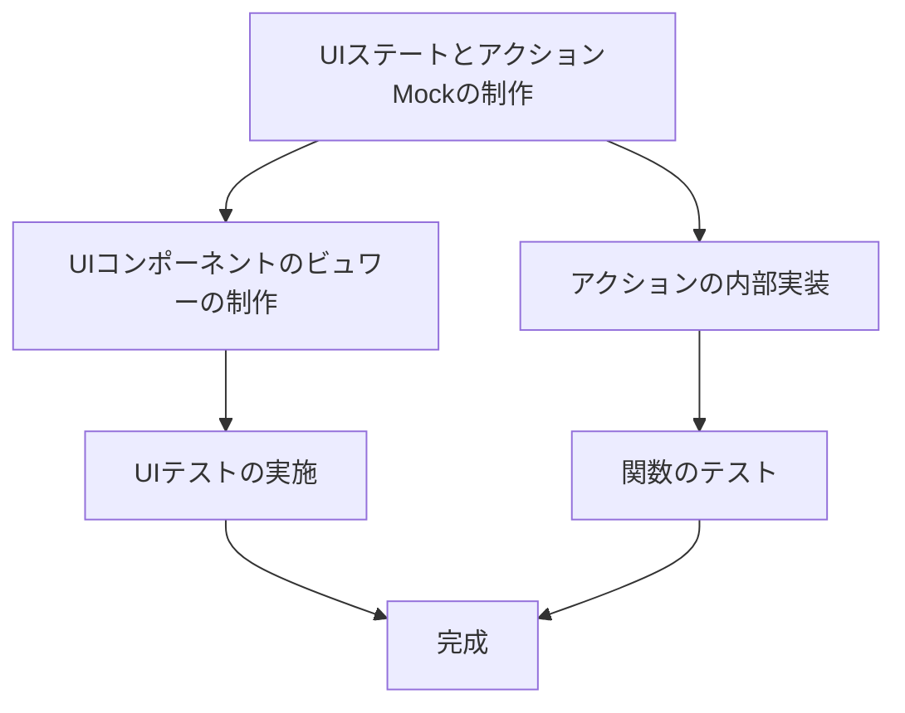

# yumemi-frontend-task

## 入門

1. nodejsのバージョン管理ソフト`volta`をインストール
2. RESAS API KEY を下記のサイトから会員登録し取得
    - https://opendata.resas-portal.go.jp/form.html
3. `.env.local`をコピーし、RESAS_API_KEYに対し上記から取得したトークンを代入
4. `yarn install` を実行し必要なパッケージをインストール
5. `yarn dev`を実行し、 http://localhost:3000 へアクセス

### Workflow

下記に、各種役割分担を記載する。
基本的には図１のようになる。

図１

関数・UIともにReactContextを使用し、DI的に実装、UI意外に纏わるプロパティを命令しないように心がける。

#### UIステートとアクションMockの制作

1. 純粋なRedux的パラメーターでContextを実装する
    - 今回はXStateを用いて実装
1. 上記のステートを用いて外部リソースからステートを変更するためのアクションを制作する。

#### コンポーネント制作タスク

1. UIステートの制作 で制作したステータスを`useContext`を使用し、ステータス内部にあるものを取得し描画し、CSS設計をする
1. UIアクションMockの制作したものを用いて、各アクションを呼び出す
1. Storybookを用いてUI挙動の確認を行う

#### ロジック制作タスク

1. UIアクションMockの内部処理を埋める。
1. 煩雑なビジネスロジックを記述した場合Jestを用いてテストを実施する。

#### Storybook/Jestに関して

定義する際は面倒かもしれないが、テストを残すことにより、「後続の開発効率向上・デグレの防止・単体ごとの修正コスト」を狙いとしているため、極力記述お願い致します。

## 概要

### 各種リンク

- [フロントエンドコーディング試験](https://notion.yumemi.co.jp/0e9ef27b55704d7882aab55cc86c999d)
- [フロントエンドコーディング試験ワイヤーフレーム](https://notion.yumemi.co.jp/ab4a837f8e764dffb0fc93c7b1387af7)
- [ワイヤーフレーム - Figma](https://www.figma.com/file/qZWJeXzXWuIrXjKOtlqHib/Untitled?node-id=0%3A1)
- [Kanban - Trello](https://trello.com/w/yumemifrontendtask)
- [Sgaging環境](https://yumemi-frontend-task.vercel.app/)

### CSSガイドライン

- RSCSS準拠 - [RSCSSとは](https://rfs.jp/sb/html-css/html-css-guide/rscss.html)
    - 粒度が低すぎるコンポーネントに関しては上記の限りではない。
- {ComponentName}.module.sass を使用すること。
- [css variable](https://developer.mozilla.org/ja/docs/Web/CSS/Using_CSS_custom_properties)を積極的に使用する

## Q&A

### fetchでquery parameterを渡したい

[fetchでクエリパラメータを渡す方法 - qiita](https://qiita.com/nikiperusuu/items/2a653f2381bd5ae35c10)
